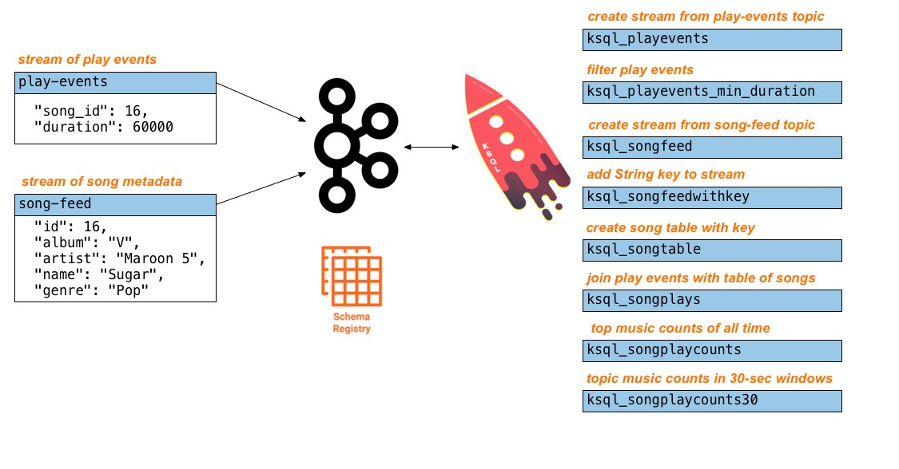

# Music

[Building streaming application KSQL](https://www.confluent.io/blog/building-streaming-application-ksql)

# Overview

The music demo is the KSQL version of the [Kafka Streams Demo Application](https://docs.confluent.io/current/streams/kafka-streams-examples/docs/index.html).
This isn't an exact replica of that demo because some features in Kafka Streams API are not available yet in KSQL (coming soon!).
Some of these differences are noted in the [KSQL commands](ksql.commands).

Follow along with the video [Demo: Build a Streaming Application with KSQL](https://www.youtube.com/watch?v=ExEWJVjj-RA).

# Prerequisites

## Local

As with the other demos in this repo, you may run the entire demo end-to-end with `./start.sh`, and it runs on your local Confluent Platform install.  This requires the following:

* [Confluent Platform 5.1](https://www.confluent.io/download/)
* Java 1.8 to compile the data generator, i.e. the `KafkaMusicExampleDriver` class
* Maven to compile the data generator, i.e. the `KafkaMusicExampleDriver` class

## Docker

Follow the [step-by-step guide](live-coding-ksql-music.adoc). This requires the following:

* Docker version 17.06.1-ce
* Docker Compose version 1.14.0 with Docker Compose file format 2.1

# What Should I see?

* If you are running Confluent Platform, use Confluent Control Center to view and create KSQL queries: http://localhost:9021/development/ksql/ 
* Instead of using the music demos's REST endpoints, use KSQL to inspect the data.
